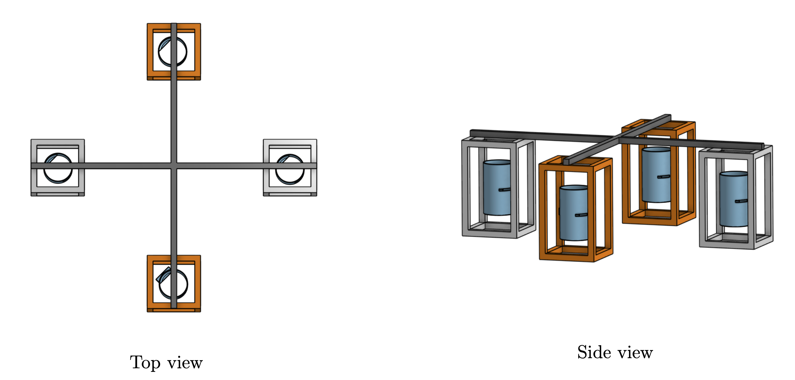
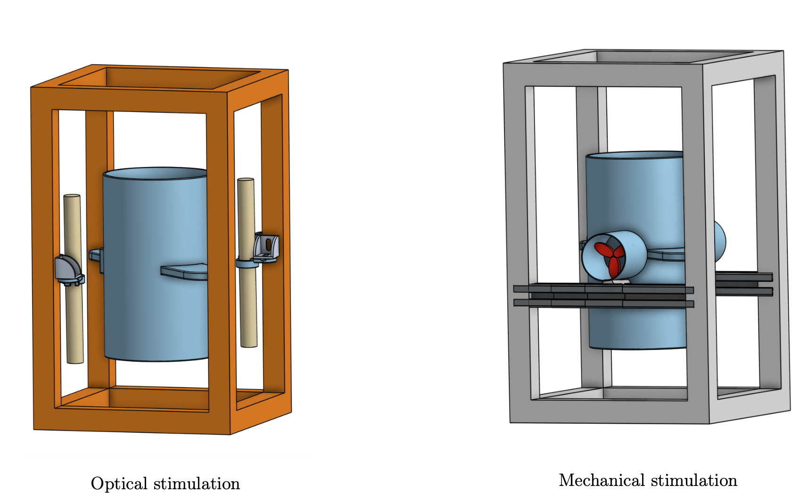
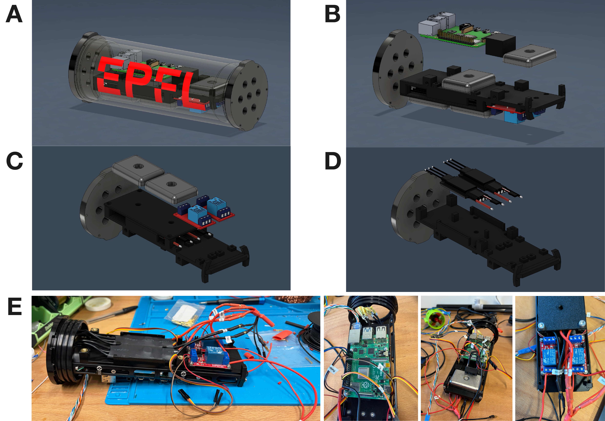
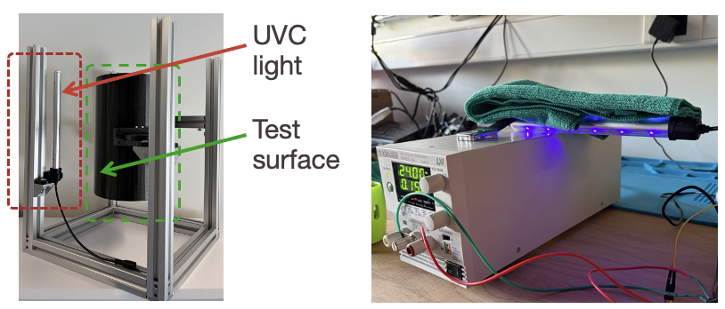
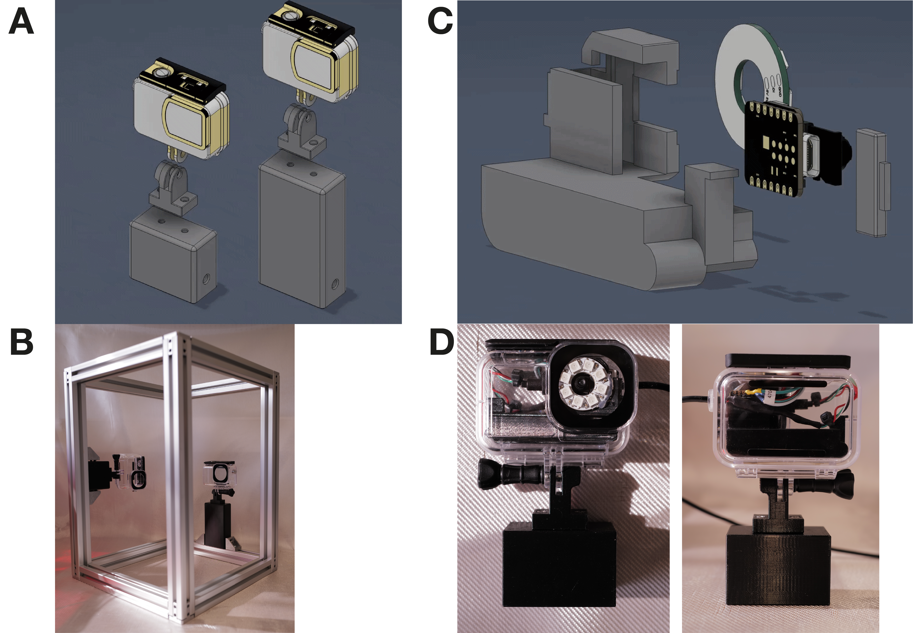
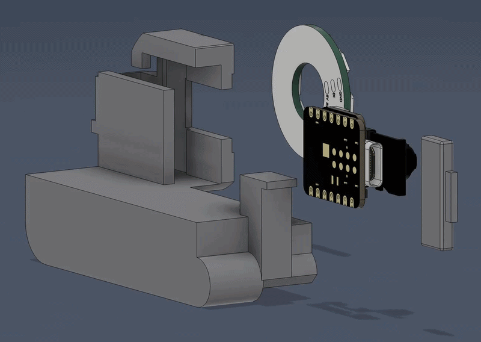
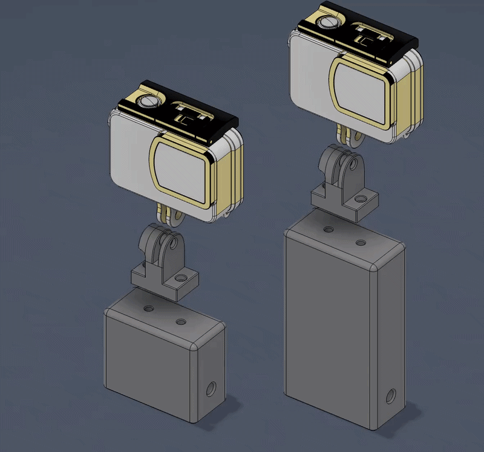

Hardware
========

The hardware is organized around a modular underwater test platform with four cages:
one UVC-treated cage, one propeller-treated cage, and two untreated control cages.
A central waterproof pod contains the electronics, while cameras and actuators are
distributed around the test surfaces.

Nest Structure
--------------

The nest uses 30 × 30 mm aluminium extrusion profiles arranged as four experimental
cages around a central structure. Each cage contains a cylindrical test surface and
supports one camera. The four-cage layout allows treated and untreated surfaces to be
compared under similar environmental conditions.

The mechanical structure is designed to be modular so that individual stimulation
modules or test surfaces can be replaced without redesigning the complete system.

   Mechanical structure of the four-cage experimental platform.

   Mechanical structure of the two actuated cages.

Waterproof Enclosure
--------------------

The main electronics are housed in a single waterproof cylindrical pod. The pod
contains the pod Raspberry Pi, buck converter, relays, ESCs, ballast weights, and
internal wiring.

Power and data enter through sealed WetLink penetrators. The pod acts as the local
distribution point for the cameras, UVC lamps, and propellers.

   Assembly and images of the underwater Pod.

Electronics
-----------

The system uses a 24 V supply. Power is transmitted to the underwater pod at 24 V
to reduce losses along the tether and is converted locally to 5 V for the Raspberry Pi.

The main electronic components are:

* 2 × Raspberry Pi 4B
* 2 × 24 V to 5 V buck converters
* 2 × relays for UVC switching
* 2 × electronic speed controllers (ESCs)
* 4 × XIAO ESP32-S3 camera modules
* 4 × addressable LED rings
* 2 × UVC lamps
* 2 × propellers

The underwater Raspberry Pi controls the relays and ESCs and communicates with the
camera modules over USB.

UVC System
----------

The optical stimulation uses two waterproof UVC-LED lamps mounted around one test
cage. The lamps emit at approximately 270–280 nm and are switched on and off using
relays controlled by the pod Raspberry Pi.

The lamps are directed toward the test surface so that stimulation remains localized.
The final exposure duration and duty cycle are parameters of the biological experiment
rather than fixed hardware settings.

   UVC lamp test setup.

Propellers
----------

Two underwater propellers provide localized hydrodynamic stimulation around one test
surface. Each propeller is driven through an ESC using a servo-style PWM command.

A pulse width of 1500 µs corresponds to idle, while larger pulse widths increase the
propeller speed. The final mounting places the propellers so that the generated flow acts
across the cylindrical test surface.

Camera System
-------------

Each cage is monitored by a Seeed Studio XIAO ESP32-S3 Sense camera module.
An addressable LED ring around each camera provides controlled illumination for
repeatable image capture.

The camera and LED ring are installed in a dedicated holder that keeps the field of
view fixed relative to the test surface. Images are transferred over USB to the pod
Raspberry Pi.

   Overview of cameras and attachment to cages.

   GIF 1

   GIF 2
